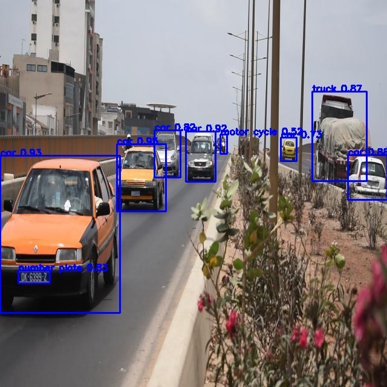

# Vehicle-Counting-and-Helmet-Compliance-Detection-Using-YOLOv8
This project implements a real-time vehicle detection and tracking system using YOLOv8 to monitor the flow of traffic, counting the entry and exit of vehicles such as buses, trucks, cars, and motorcycles. Additionally, the system identifies whether motorcycle riders are wearing helmets, ensuring helmet compliance for enhanced road safety. Designed for efficiency and scalability, this solution is ideal for traffic management and road safety monitoring.

## Result

  

